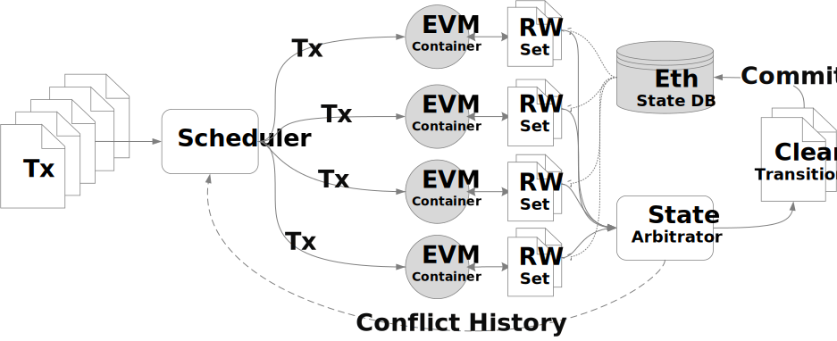

# Concurrent State Management
The [Ethereum](https://github.com/ethereum) ecosystem incorporates the Ethereum Virtual Machine (EVM), a stateless virtual machine responsible for executing binary code compiled from Solidity source files. When the EVM interacts with state data such as input and variables, it relies on a designated database known as statedb. The outcomes of these interactions are subsequently saved within the stateDB.

## Limitation

The Ethererum state trie, designed specifically for calculating the hash root, proves its utility in the hash generation process. In the absence of such a requirement, utilizing a plain database directly is considered a more efficient alternative. A notable limitation of the original design is its inability to manage concurrency . Attempting to have multiple EVMs share the same Trie introduces thread safety problems.

##  Integration
The primary objective is to introduce a dedicated state cache engineered to support **multiple EVMs concurrently processing multiple transactions.** The module serves as the coordinator for accesses initiated by multiple EVM instances. The original storage module, consisting of a trie and a primary database, remains in read-only during execution and undergoes updates only once when a block cycle concludes. 

  

##  Major Components

Below are some major Components:

- **Dedicated Write Caches:** A dedicated cache for each EVM instance, and at the end of each execution cycle, extract accesses and updates.

- **Conflict Detection:** Detect potential conflicts among data accesses and updates.

- **Root Hash Calculation:** Consolidate all updates into a single Trie for efficient root hash calculation.

- **Database Update:** Eventually, flush the accumulated updates to the primary database.

##  More Info
For further details and integration guidelines with Arcology, please refer to [our design documents.](https://doc.arcology.network/arcology-concurrency-control/evm-integration)

## License

All other files within this repository are licensed under the MIT License unless stated otherwise.