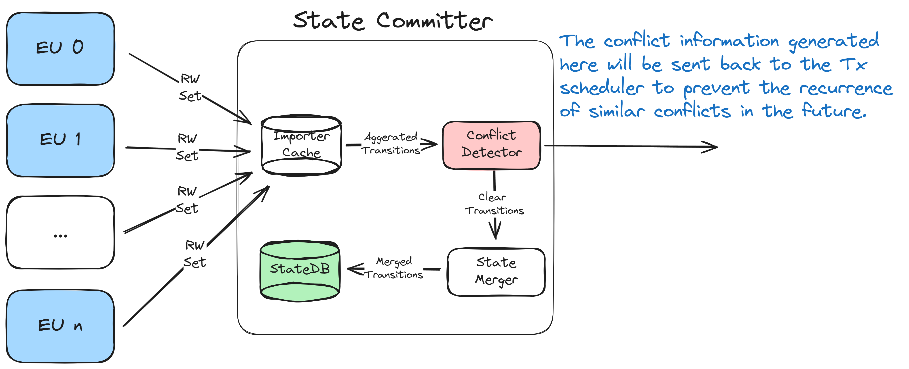

# Concurrent State Committer
The [Ethereum ecosystem](https://github.com/ethereum) incorporates the Ethereum Virtual Machine (EVM) for transaction processing. When the EVM interacts with state data such as input and variables, it relies on a designated database known as statedb. The outcomes of these interactions are subsequently saved within the stateDB.

## What Is Concurrent Committer

A notable limitation of the original design is its inability to manage concurrency. Attempting to have multiple EVMs share the same Trie introduces thread safety problems.

Arcology replace the original stateDB with [a write cache]() for every EVM instance running in parallel. 

The primary objective for this project 

is to introduce a dedicated state cache engineered to support **multiple EVMs concurrentVly processing multiple transactions.**

## Responsiblities

##  Integration
 The module serves as the coordinator for accesses initiated by multiple EVM instances. The original storage module, consisting of a trie and a primary database, remains in read-only during execution and undergoes updates only once when a block cycle concludes. 

  

##  Major Components

Below are some major Components:

| Component                   | Description                                                                   |
|---------------------------|-------------------------------------------------------------------------------|
| Dedicated Write Caches    | A dedicated cache for each EVM instance, extracting accesses and updates at the end of each execution cycle. |
| Conflict Detection        | Detect potential conflicts among data accesses and updates.                    |
| Root Hash Calculation     | Consolidate all updates into a single Trie for efficient root hash calculation. |
| Database Update           | Eventually flush the accumulated updates to the primary database.              |

<h2> More Info    </h2>

For further details and integration guidelines with Arcology, please refer to [our design documents.](https://doc.arcology.network/arcology-concurrency-control/evm-integration)

<h2> License    </h2>
## License
This project is licensed under the MIT License.