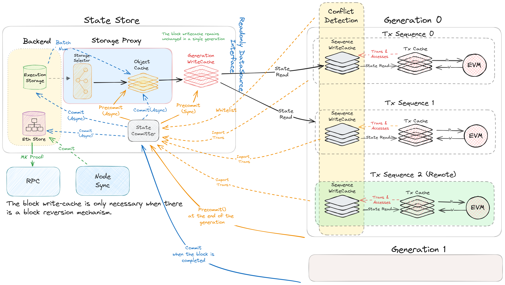

<h1> Storage   </h1>

The concurrent Storage committer is a module responsible for merging and flushing, in batch mode, the state transitions generated by parallel EVM instances into the Arcology storage.

<h2> What Is the Concurrent Storage  </h2>

Arcology Network's storage layer is a key module that supports parallel transaction processing and facilitates concurrency. The Ethereum Virtual Machine (EVM) relies on the stateDB for reading and writing state data. A limitation of the original design is its inability to manage concurrency. Attempts to have multiple EVMs share the same StateDB introduce thread safety problems. 

<h2> Design   </h2>

The module is responsible for the following tasks. 

- Gathering state transitions asynchronously from mutiple EVM instances.
- Categorizing transitions based on their memory slot info.
- Detecting potential access conflicts and reverting transitions related to the transaction causing them. 
- Writing the transitions to the Ethereum stateDB in batch.

<!--   -->

 

>> To support parallel updates in batch mode, similar to the EVM, the original Ethereum Trie implementation has already been parallelized through some special extensions.

<h2> Modules </h2>

The module consists of the following storage components:
- **Execution Cache:** A cache that stores the clear state transitions generated from a single transaction generation.
 The generation cache needs to be flushed as soon as a batch of generation state transitions is ready. So the subsequent generation can have immediate access to the latest state. The cache is cleared after the last generation state transition batch is generated.

- **Object Cache:** An in-memory cache for the latest state of the blockchain. The Object cache is updated after a new block is confirmed. If the object cache isn't a full copy of the execution storage, entries may be to cache eviction. When this happens it needs to be ensured that the update entries won't be evicted before they are flushed to the execution storage. 
  
- **Execution Storage:** A storage only for the last state of the blockchain.
  
- **Eth storage:** The Ethereum stateDB. It is mainly for generating the Merkle proof for end users and the consensus layer.

 

<h2> More Info    </h2>

For further details and integration guidelines with Arcology, please refer to [our design documents.](https://doc.arcology.network/arcology-concurrency-control/evm-integration)

<h2> License    </h2>

This project is licensed under the MIT License.