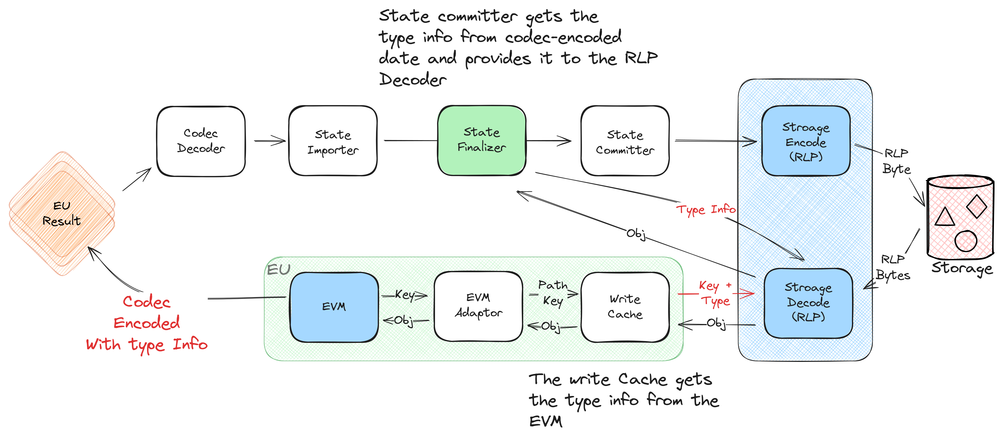

<h1> Concurrent State Committer   </h1>

The concurrent state committer is a module responsible for merging and flushing, in batch mode, the state transitions generated by parallel EVM instances into the Ethereum stateDB.

<h2> What Is Concurrent Committer  </h2>

The Ethereum Virtual Machine (EVM) relies on the stateDB for reading and writing state transitions. A notable limitation of the original design is its inability to manage concurrency. Attempts to have multiple EVMs share the same Trie introduce thread safety problems.

Arcology Network is a blockchain that supports parallel processing, necessitating a storage layer that facilitates concurrency. This project is a key element of a comprehensive design to address this issue.

<h2> Design   </h2>

The module is responsible for the following tasks. 

- Gathering state transitions asynchronously.
- Categorizing them based on the memory slot.
- Detecting potential access conflicts and reverting transitions related to the transaction causing them. 
- Writing the transitions to the Ethereum stateDB in batch.

>> To support parallel updates in batch mode, the original Trie implementation has already been parallelized.

 

<h2> More Info    </h2>

For further details and integration guidelines with Arcology, please refer to [our design documents.](https://doc.arcology.network/arcology-concurrency-control/evm-integration)

<h2> License    </h2>

This project is licensed under the MIT License.